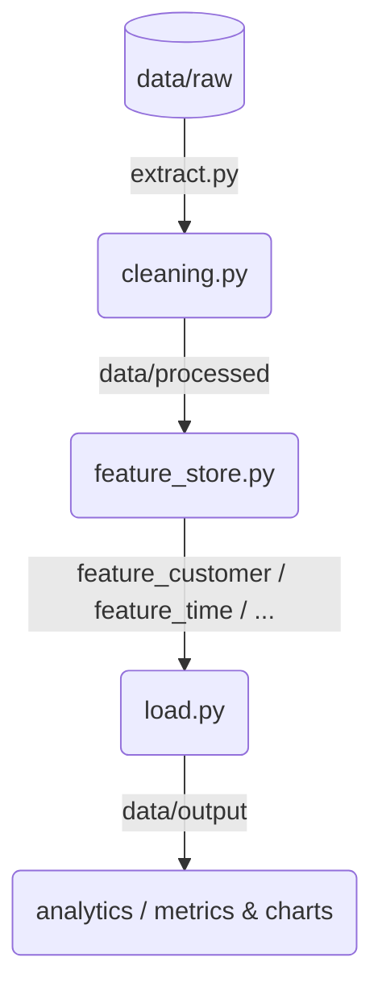

# 📊 [Nome-Do-Projeto] (ex: Visitor-Data-Engine)

[](https://python.org)
[](https://pydata.org)
[](https://plotly.com)
[](https://streamlit.io)

Plataforma empresarial de Engenharia de Dados desenvolvida para extração, higienização, engenharia de recursos e análise preditiva de dados de visitação. O projeto utiliza uma abordagem de programação funcional aplicada a dados, estruturando transformações imutáveis através de pipelines modulares até a geração de relatórios e métricas de negócios.

---

## 🏗️ Arquitetura do Projeto (Padrão de Mercado)

A solução foi desenhada seguindo os princípios de alta coesão e baixo acoplamento. Cada etapa do processo de dados possui responsabilidade única dentro da pasta `src/`:

```text
project/
│
├── data/                       # Repositório de Dados (Camadas de Maturidade)
│   ├── raw/                    # Dados brutos originais do extrator
│   ├── processed/              # Tabelas higienizadas após limpeza inicial
│   └── output/                 # Datasets finais enriquecidos e agregados
│
├── src/                        # Código-Fonte Principal
│   ├── extract/                # Camada de Ingestão e Conexão de Fontes
│   │   └── extract.py
│   │
│   ├── transform/              # Camada de Transformação e Feature Engineering
│   │   ├── cleaning.py         # Tratamento de nulos, tipos e padronização textual
│   │   ├── feature_store.py    # Orquestração e centralização de recursos
│   │   ├── features.py         # Regras genéricas de engenharia de recursos
│   │   ├── feature_product.py  # Recursos focados no produto/serviço
│   │   ├── feature_customer.py # Segmentação de perfil do cliente (Idade, Região)
│   │   ├── feature_time.py     # Engenharia de variáveis temporais (Horários, Meses)
│   │   ├── feature_abc.py      # Curva ABC e classificação de relevância
│   │   └── feature_churn.py    # Indicadores e métricas de evasão/fidelidade
│   │
│   ├── analytics/              # Camada de Inteligência e Visualização
│   │   ├── metrics.py          # Agregações, volumetria e KPI's matemáticos
│   │   └── charts.py           # Motores de renderização gráfica dinâmicos
│   │
│   ├── pipeline/               # Orquestração de Fluxo Dinâmico (.pipe)
│   │   └── pipeline.py
│   │
│   ├── load/                   # Módulo de persistência e gravação de arquivos
│   │   └── load.py
│   │
│   └── config/                 # Configurações globais e variáveis de ambiente
│       └── paths.py            # Gerenciamento automatizado de caminhos relativos
│
├── main.py                     # Ponto de Entrada único do Pipeline
├── requirements.txt            # Dependências e bibliotecas do projeto
└── README.md                   # Documentação Técnica
```

---

## 🔁 Fluxo de Execução do Dado (ETL)

O ciclo de vida do dado dentro da aplicação segue uma jornada linear e previsível através da orquestração do `main.py`:



1. **Extract (`extract.py`)**: Consome os dados brutos e os entrega de forma estruturada.
2. **Cleaning (`cleaning.py`)**: Normaliza nomenclaturas de colunas para *Title_Case*, remove caracteres especiais e trata valores nulos com termos de controle padrão.
3. **Features (`feature_*.py`)**: Aplica lógica vetorial (via `np.select` e `np.where`) para segmentar idades, horários em formato de visualização textual (como períodos de turnos e faixas `Extra`), demografia e análises preditivas de churn.
4. **Load (`load.py`)**: Escreve o dado sanitizado e enriquecido nas respectivas pastas de saída.
5. **Analytics (`metrics.py` & `charts.py`)**: Transforma dados brutos processados em insights visuais de alta fidelidade prontos para o consumo executivo.

---

## 🚀 Como Executar a Aplicação

### 1. Preparação do Ambiente
```bash
# Clone o repositório
git clone https://github.com
cd seu-repositorio

# Criação e ativação do ambiente virtual (Venv)
python -m venv .venv
source .venv/bin/activate  # No Linux/Mac
.venv\Scripts\activate     # No Windows

# Instalação das dependências de mercado
pip install -r requirements.txt
```

### 2. Executando o Pipeline Completo
Para acionar o gatilho de ponta a ponta do ecossistema de dados, basta rodar o arquivo principal na raiz do projeto:
```bash
python main.py
```
*Este comando lerá a camada `raw`, executará os scripts de limpeza, calculará as features categorizadas de clientes/tempo e salvará os resultados analíticos processados na pasta `output`.*

---

## 🛡️ Práticas de Engenharia Adotadas

* **Imutabilidade:** O DataFrame original nunca é alterado; as funções geram cópias modificadas de forma sequencial utilizando encadeamentos de `.pipe()`.
* **Segurança de Tipos:** Conversões explícitas usando `.astype()` e proteções contra falhas de strings nulas (`errors='coerce'`) garantem que o pipeline nunca quebre por variações de dados.
* **Caminhos Dinâmicos:** Utilização do `config/paths.py` com a biblioteca nativa `pathlib`, garantindo que o projeto funcione perfeitamente em qualquer sistema operacional (Windows, Linux, Mac) sem quebras de barras de diretórios.

---
Desenvolvido por **Fabiano Gomes Aranha** 🚀
# visitas-data-engineering

